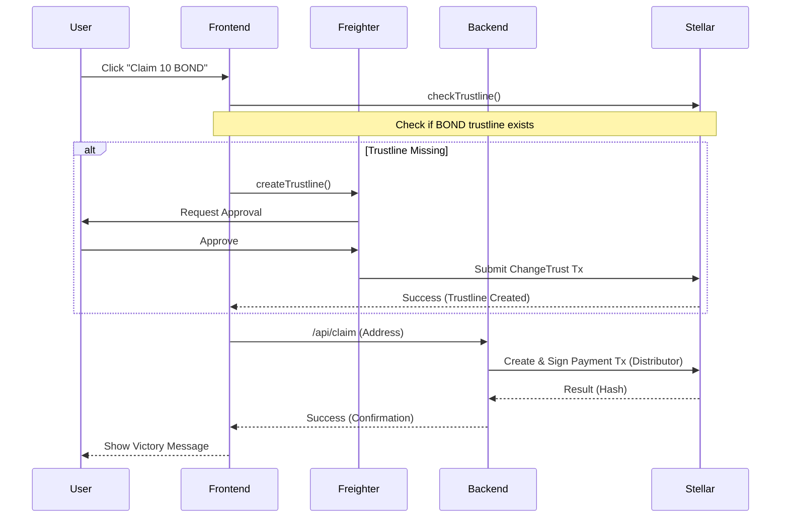
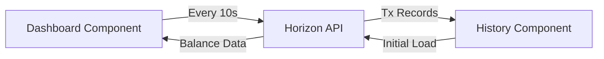

# Architecture Document: StarBond Loyalty MVP

## 🗺 System Architecture

The StarBond Loyalty MVP is a decentralized application (dApp) built on the Stellar Network. It utilizes a modern tech stack to provide a seamless user experience for claiming and managing blockchain-based rewards.

### 🔌 Component Breakdown

1.  **Next.js Frontend (React 19)**:
    -   Handles the UI/UX with Tailwind CSS 4.
    -   Manages wallet state via React Context and the `useWallet` hook.
    -   Integrates directly with the **Stellar Horizon API** for real-time data fetching (balances, transactions).

2.  **Freighter Wallet Extension**:
    -   Acts as the secure signer for all user-initiated transactions (e.g., creating trustlines).
    -   Communicates with the frontend via the `@stellar/freighter-api`.

3.  **Next.js API Routes (Backend)**:
    -   Handles the secure distribution of tokens from the **Distributor** account.
    -   Verifies trustlines on the server-side before processing payments.
    -   Uses `@stellar/stellar-sdk` for transaction building and submission.

4.  **Stellar Network (Testnet)**:
    -   Stores the global state of user balances and transaction history.
    -   Ensures immutability and transparency for all BOND token operations.

---

## 🔄 Interaction Flows

### 💰 Claiming Rewards

### 📊 Real-Time Monitoring

---

## 🔒 Security Measures

-   **Server-Side Signing**: Distributor secret keys are stored in environment variables and never exposed to the client.
-   **Trustline Verification**: Trustlines are verified both on the client (to prompt user action) and on the server (to prevent transaction failures).
-   **Secure Transacting**: All client-side transactions are signed by the user's Freighter wallet, ensuring the user retains control over their private keys.
