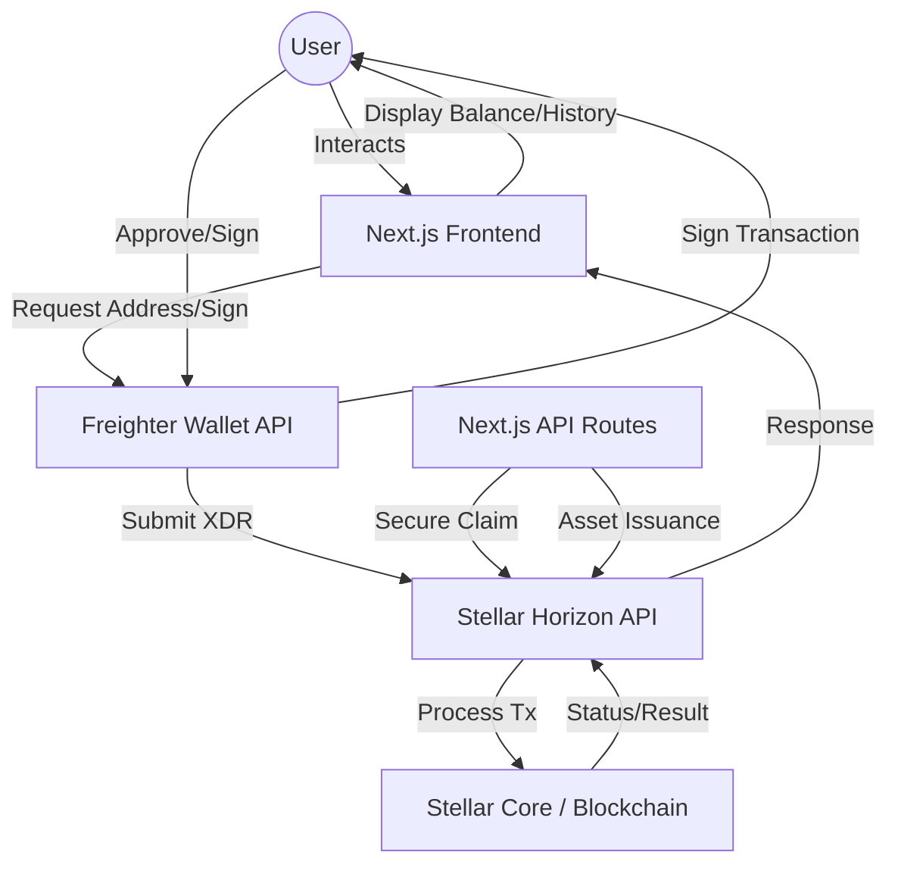

# StarBond Loyalty MVP

StarBond is a premium, blockchain-powered loyalty platform built on the **Stellar Network**. It enables brands to issue custom loyalty tokens ('BOND') and allows users to claim rewards directly via their Freighter wallet with real-time transparency.

---

## 🚀 Live Demo
**[Link to Live Demo (Placeholder)](#)**

---

## 🏗 Architecture Overview

The following diagram illustrates the interaction between the user's browser (Frontend), the Freighter Wallet extension, and the Stellar Network.



---

## 🛠 Tech Stack

- **Frontend**: Next.js 15 (App Router), React 19, Tailwind CSS 4
- **Blockchain**: Stellar Network (Testnet)
- **SDKs**: `@stellar/stellar-sdk`, `@stellar/freighter-api`
- **Wallet**: Freighter
- **Environment**: Node.js

---

## ⚙️ Setup Instructions

### 1. Prerequisites
- [Node.js](https://nodejs.org/) (v18+)
- [Freighter Wallet](https://www.freighter.app/) extension installed in your browser.

### 2. Environment Variables
Create a `.env` file in the root directory and populate it based on `.env.example`:

```env
NEXT_PUBLIC_STELLAR_NETWORK=testnet
NEXT_PUBLIC_ISSUER_PUBLIC_KEY=YOUR_ISSUER_PUBLIC_KEY
DISTRIBUTOR_SECRET_KEY=YOUR_DISTRIBUTOR_SECRET_KEY
ISSUER_SECRET_KEY=YOUR_ISSUER_SECRET_KEY
```

### 3. Installation
```bash
npm install
```

### 4. Asset Issuance (Initialization)
Run the automated script to issue the 'BOND' asset on the Testnet:
```bash
node scripts/issueToken.js
```

### 5. Local Development
Start the development server:
```bash
npm run dev
```

---

## 🌟 Key Features

- **Freighter Integration**: Secure wallet connection and transaction signing.
- **Automated Issuance**: One-click script to setup Issuer/Distributor and issue assets.
- **Smart Logic**: Automatic trustline detection and creation before claiming rewards.
- **Real-time Dashboard**: Live balance monitoring for XLM and BOND assets.
- **Transaction Explorer**: Deep-linking to Stellar Expert for every transaction.
- **Premium Design**: Dark-themed, glassmorphic UI for a modern experience.

---

## 🧪 Test Data (Placeholders)

| Role | Public Key (Address) | Status |
| :--- | :--- | :--- |
| **Test User 1** | `G...` | Ready |
| **Test User 2** | `G...` | Ready |
| **Test User 3** | `G...` | Ready |
| **Test User 4** | `G...` | Ready |
| **Test User 5** | `G...` | Ready |

---

## 📄 License
This project is licensed under the MIT License.
