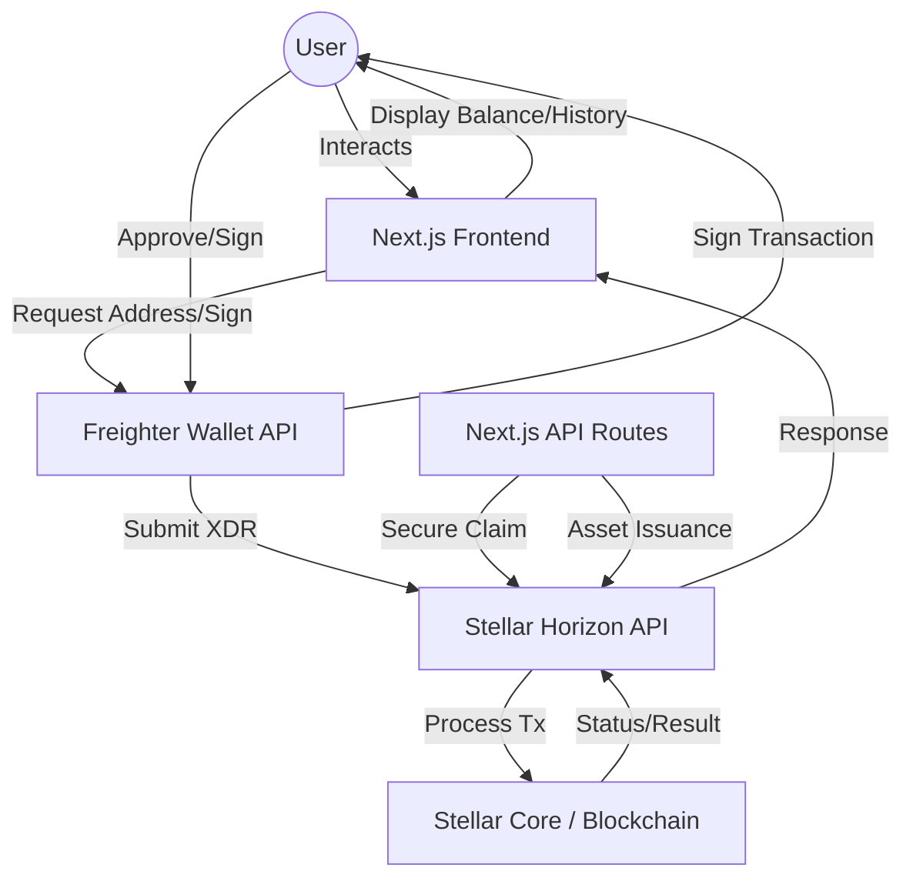

# StarBond Loyalty MVP

StarBond is a premium, blockchain-powered loyalty platform built on the **Stellar Network**. It enables brands to issue custom loyalty tokens ('BOND') and allows users to claim rewards directly via their Freighter wallet with real-time transparency.

---

## 🚀 Live Demo
**[starbond-loyalty-mvp.vercel.app](https://starbond-loyalty-mvp.vercel.app/)**

---

## 🏗 Architecture Overview

The following diagram illustrates the interaction between the user's browser (Frontend), the Freighter Wallet extension, and the Stellar Network.



---

---

## 🛠 Tech Stack

- **Frontend**: Next.js 15 (App Router), React 19, Tailwind CSS 4
- **Blockchain**: Stellar Network (Testnet)
- **SDKs**: `@stellar/stellar-sdk`, `@stellar/freighter-api`
- **Wallet**: Freighter
- **Environment**: Node.js

---

## ⚙️ Setup Instructions

### 1. Prerequisites
- [Node.js](https://nodejs.org/) (v18+)
- [Freighter Wallet](https://www.freighter.app/) extension installed in your browser.

### 2. Environment Variables
Create a `.env` file in the root directory and populate it based on `.env.example`:

```env
NEXT_PUBLIC_STELLAR_NETWORK=testnet
NEXT_PUBLIC_ISSUER_PUBLIC_KEY=YOUR_ISSUER_PUBLIC_KEY
DISTRIBUTOR_SECRET_KEY=YOUR_DISTRIBUTOR_SECRET_KEY
ISSUER_SECRET_KEY=YOUR_ISSUER_SECRET_KEY
```

### 3. Installation
```bash
npm install
```

### 4. Asset Issuance (Initialization)
Run the automated script to issue the 'BOND' asset on the Testnet:
```bash
node scripts/issueToken.js
```

### 5. Local Development
Start the development server:
```bash
npm run dev
```

---

## 🌟 Key Features

- **Freighter Integration**: Secure wallet connection and transaction signing.
- **Automated Issuance**: One-click script to setup Issuer/Distributor and issue assets.
- **Smart Logic**: Automatic trustline detection and creation before claiming rewards.
- **Real-time Dashboard**: Live balance monitoring for XLM and BOND assets.
- **Transaction Explorer**: Deep-linking to Stellar Expert for every transaction.
- **Premium Design**: Dark-themed, glassmorphic UI for a modern experience.

---

## 📝 User Feedback Implementation

Based on user feedback collected via our [User Feedback Form](./USER_FEEDBACK_FORM.md), the following improvements were implemented:

| # | Feedback Statement | Change Made | Commit ID |
|---|-------------------|-------------|-----------|
| 1 | **"The disconnect button is hard to find, it blends into the background too much."** | Redesigned the disconnect button with a **red color scheme**, **logout icon**, and **increased contrast** to make it immediately visible. | `bb69801` |
| 2 | **"I wish I could copy my wallet address to clipboard with one click."** | Added a **copy-to-clipboard** feature on the wallet address in the Navbar with **green checkmark** visual feedback and **"Address copied!" toast** notification. | `8c3c0bf` |
| 3 | **"I didn't know I needed a Trustline... It would be nice to have a short explanation."** | Added an **inline explanation box** and **info icons** that explain what a Trustline is when users are prompted to create one, improving onboarding clarity. | `d835677` |

> **Files Modified**: `src/app/page.tsx`, `src/components/Navbar.tsx`, `FEEDBACK.md`  
> **Full Feedback Responses**: [USER_FEEDBACK_FORM.md](./USER_FEEDBACK_FORM.md)

---

## 🧪 Submission Requirements Checklist

- **Architecture Document**: [ARCHITECTURE.md](./ARCHITECTURE.md)
- **User Feedback**: [FEEDBACK.md](./FEEDBACK.md)
- **User Feedback Form**: [USER_FEEDBACK_FORM.md](./USER_FEEDBACK_FORM.md)
- **Demo Video**: **[Watch Demo Video](https://www.youtube.com/watch?v=e-wohp52qes)**
- **User Feedback Evidence**: [FEEDBACK.md](./FEEDBACK.md)

### 👥 Test User Addresses (Verifiable)

| Role | Public Key (Address) | Status |
| :--- | :--- | :--- |
| **Issuer (BOND)** | `GBD7LSRGQBUGGETBYE3Q6AI3UGH2FJ6SG53S2BSQ545HAD7V4VG6CAM2` | Active |
| **Distributor** | `GDUZ7WE7SGM7I242Z4RJ2VDZXS7DQ7JKCVCM7CXORETWDAAN4CHH3TLU` | Active |
| **Test User 1** | `GCI4FVG5Q5IGW3IYFPKVNNNPASEDOXD43SWUYISRHLTNSFAWZJG4A7CJ` | Active |
| **Test User 2** | `GA3WKZPAEMGMMMB5PJKWPITIFD54SECIID3V4QKNB3ARROYQNCKHBPI2` | Active |
| **Test User 3** | `GCA2WI5PBFRJI7KKJT5I6Z33V6OGKZFXRXLYW3TQGQPGJ2JEQVGZDJUB` | Active |

---

## 🔗 Deployment

To deploy this project to the public web (Level 5):

1.  **GitHub**: Create a public repository and push your code.
2.  **Vercel**: Link your GitHub repo to Vercel.
3.  **Environment Vars**: Add `NEXT_PUBLIC_STELLAR_NETWORK`, `NEXT_PUBLIC_ISSUER_PUBLIC_KEY`, and `DISTRIBUTOR_SECRET_KEY` to Vercel settings.
4.  **Done**: Your app will be live at `*.vercel.app`.

---

## 📄 License
This project is licensed under the MIT License.
